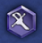
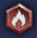
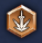
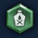
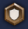

<h1>Auto Gladiators | Dota 2 Bot</h1>

  
  

<h5>Yo! I'm really feeling lazy about finishing this project. It's currently incomplete, and I won't be making any further updates without a specific request.</h5>

<b>What can the bot do?</b>

- Determines the primary attribute of a character. 
- Chooses abilities according to the main attribute. 
- Keeps the gold balance around 1000 (1020 gold for the last reroll, and 1100 for the last skill). 
- If there's not enough gold or an action might disrupt income, the bot blocks the current suggested abilities and buys them when there's enough gold. 

<b>What to improve or develop (stars indicate the level of difficulty):</b>

- System for determining the main attribute (taking screenshots with such low resolution isn't ideal; ideally, it should be rewritten to link directly to the hero) ** 
- Set up basic builds for the bot to follow when building the character * 
- Custom configs for income, dropping income if the character's health falls below a certain threshold ** 
- Automatic hero selection, item choice, and talent picking * 
- Proper operation at any screen resolution * 
- The project was developed on MacOS, but compatibility with Windows should be ensured by default. 

Good luck. 
<b>You can find me on Telegram @IBudakov</b>

  
  

